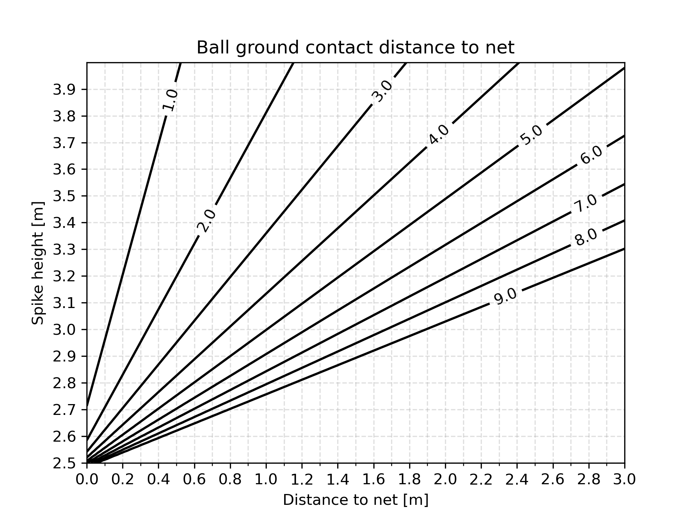

# Volleyball Spike Simulator
With this code, you can see where a spiked ball will land on the other side of the court based on the height of the
spike and its distance from the net.

The goal is to determine the required height and proximity to the net for a spike to land at a specific distance from
the net.

## Method
The most efficient approach was to apply the 'theorem of intersecting lines'. Consider a triangle where the upper edge
represents the midpoint of the ball, one lower edge represents the vertical projection of the ball, and the other lower
edge indicates the spot where the ball will land. By fitting in the vertical line of the net, you can derive a formula
to determine where the ball will land based on its spike height and distance from the net.

The formula is implemented in the code and can be solved for multiple spike points (x and y coordinates).
## Result
A contour plot is a suitable representation to visualize the relationship between various spike points and the
corresponding landing spot. The contour lines represent the distance from the point of ball contact on the ground to
the net.

For example, to hit the 3-meter line when you are 1 meter away from the net, you need to spike the ball at a height of
approximately 3.36 meters.

## Considerations
This code neglects the 3D-space, the effects of gravity and spin, so it is only applicable for hard and short hits. Or
in other words, weaker spikes from further away are not accurately represented.